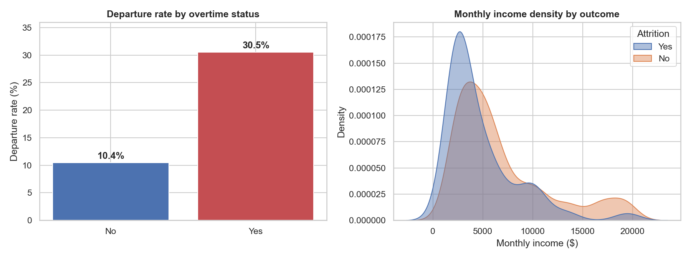
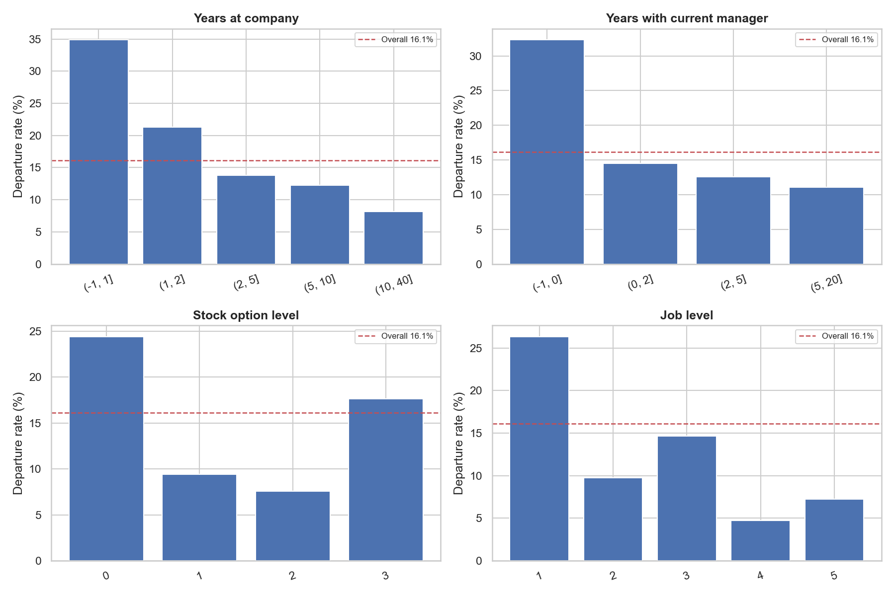
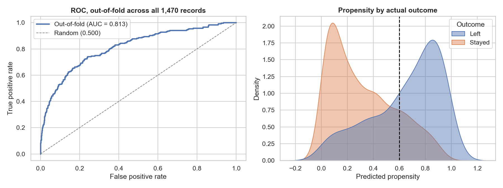
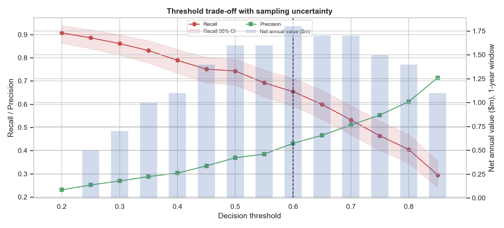
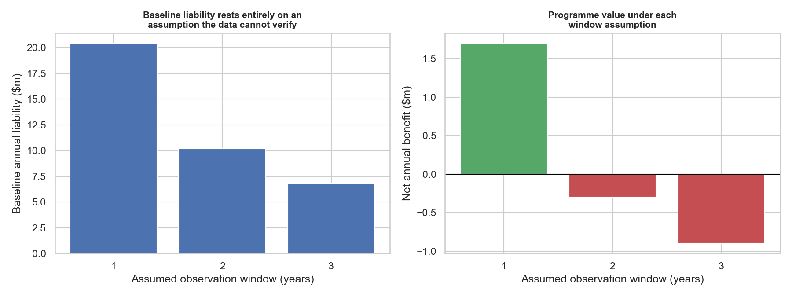
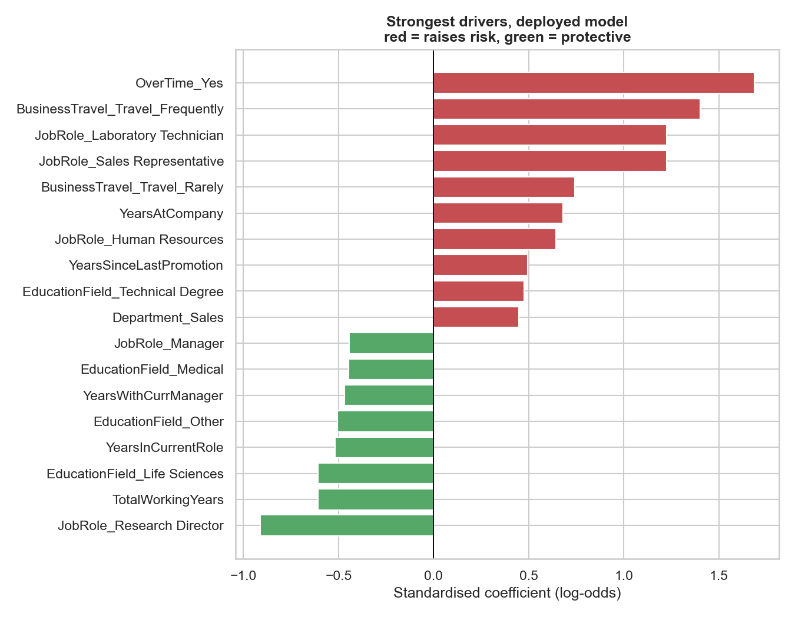

**Client:** Helix Systems Group, Inc.

**Consultant:** Philip Wouter Roos, BEng (Chemical Engineering), University of Pretoria

**Programme:** Master of Science in Business Analytics, Quantic School of Business and Technology

\newpage

---
title: "The Employee Retention Predictor"
subtitle: "Designing Analytics Solutions: From Strategy to Proof of Concept"
author: "Philip Wouter Roos | Roos Analytics"
date: "MSBA Capstone Project | Quantic School of Business and Technology"
---

\newpage

# Executive Summary

Helix Systems Group ("Helix") is a mid-sized technology enterprise of 1,470 employees whose engineering capability underpins its market position, and whose ability to retain that capability is not currently managed. The workforce record shows **237 departures, a prevalence of 16.1%**. At a replacement cost of 1.5 times annualised salary, and on the stated assumption that those departures occurred within a single year, Helix is absorbing an estimated **$20.4 million in annual replacement cost** without any mechanism to anticipate, target or prevent a single one of them.

The root cause is not compensation policy. It is timing. Helix's HR function operates reactively: attrition is recognised at resignation, when the cost is committed and the only response is requisition and backfill. Every dollar of that liability is spent after the decision to leave has been made.

This engagement proposes **The Employee Retention Predictor**, a supervised machine-learning proof of concept that scores every active employee for **relative propensity to leave**, using twenty-six behavioural, compensation and tenure variables already held in the HRIS. The model converts attrition from a lagging indicator into a leading one, giving HR business partners lead time they currently do not have.

**Two constraints on that claim are stated at the outset, because both are material to the investment decision.**

*The model ranks, it does not forecast.* The available data is a cross-sectional snapshot with no time-to-event structure. The model identifies **who** is at elevated risk relative to their colleagues, not **when** any individual will act. It is a triage instrument for deciding who to talk to now, not a forecast of departure dates.

*The financial case depends on an unverified time anchor.* The dataset records that 237 employees left, not over what period. If those departures accumulated over three years rather than one, the true annual liability is approximately $6.8 million and the programme does not pay. Establishing the true annual attrition velocity from date-stamped HRIS records is the first and cheapest action in the roadmap, and a gate on any budget release.

**Validated performance.** Under nested cross-validation across all 1,470 employees — with the decision threshold selected inside an inner loop so that no evaluation data informs any tuning — the model achieves an **ROC-AUC of 0.813** and identifies **65% of employees who subsequently departed at 43% precision**, while excluding every protected attribute and the one significant proxy variable in the dataset.

**The economics.** A departure costs Helix roughly $86,000. A targeted retention intervention costs roughly $5,700. That 15:1 asymmetry means the programme breaks even if only **one in six** correctly identified leavers is retained, against published benchmarks suggesting roughly one in three. At a one-year observation window the programme returns approximately **$1.7 million net on a 77% first-year ROI, with payback inside seven months**, and remains value-positive across the full joint range of model performance and intervention effectiveness.

**What is not yet established.** The classifier is a sensor: it creates lead time, it does not by itself retain anyone. The return depends on the effectiveness of an HR intervention that has never been measured at Helix. The recommendation is therefore to fund a gated, measurable pilot — not to commit the full retention budget on a projection.

# Company Overview

Helix Systems Group, Inc. is a privately held technology enterprise headquartered in Austin, Texas, with an engineering and manufacturing campus in the same metropolitan area and commercial offices in Boston and Munich. Founded in 2004, Helix designs, builds, and supports **connected diagnostic instrumentation and the embedded software platform that runs it** — benchtop analysers, sample-handling automation, and the cloud data layer that hospital and commercial laboratories use to schedule, calibrate, and audit those instruments. The company reported approximately $310 million in revenue in the most recent financial year against a headcount of 1,470.

*Business model.* Helix operates a hybrid capital-plus-recurring model. Instrument sales generate the initial contract value; the recurring layer — reagent and consumable supply, service contracts, and per-seat subscription to the Helix Cloud analytics platform — now accounts for just over half of gross margin and is the strategic engine of the business. This model is deliberately engineering-heavy: the company's ability to keep instruments in the field, certified and supported over a ten-to-fifteen-year service life, is what converts a one-time sale into a decade of annuity revenue.

*Business unit in focus.* This engagement is scoped to the **whole permanent workforce**, but the analytical and commercial centre of gravity is the Research and Development organisation, which accounts for 961 of 1,470 employees — 65% of headcount. R&D houses the firmware, embedded systems, and platform engineering teams, alongside the laboratory scientists and technicians who validate instrument performance against regulatory standards. The Sales organisation (446 employees) and a small Human Resources function (63 employees) complete the establishment.

*Competitive advantages.* Helix competes against substantially larger diversified instrument manufacturers on three grounds. First, **regulatory depth**: the company's submissions and post-market surveillance capability is built on long-tenured staff who have carried products through multiple certification cycles, and this institutional knowledge is not readily purchasable on the open market. Second, **integration**: competitors sell instruments and license third-party informatics; Helix ships a single vertically integrated stack, which materially reduces validation burden for the customer laboratory. Third, **service responsiveness**: field engineering median time-to-resolution is meaningfully better than the segment benchmark, and this metric is the single most cited driver in renewal decisions.

All three advantages share one dependency. They are held in the heads of specific engineers, scientists, and field representatives, and they degrade the moment those people leave. Helix's competitive position is, in a precise and quantifiable sense, a function of its retention rate.

# Team and Project

## Project Description

The project applies **supervised binary classification** to the client's employee record in order to estimate, for each active employee, the **relative propensity to leave voluntarily**. The target variable records *whether* an employee left, not *when*, so the model is a propensity ranker rather than a time-to-event forecaster. This constraint is load-bearing and is carried through every claim in this report.

The analytical challenge sits at the intersection of three functional areas. The first is **human capital management**, which supplies the domain vocabulary — attrition, regrettable versus non-regrettable turnover, flight risk, time-to-fill, ramp-to-productivity — and, critically, the constraints on what may lawfully and ethically be done with a risk score once it exists. The second is **applied statistical learning**, which supplies the method: feature engineering across categorical and ordinal HR variables, treatment of a materially imbalanced target class, model selection between interpretable and ensemble classifiers, and threshold optimisation under an asymmetric cost function. The third is **managerial finance**, which supplies the decision rule: a model is only worth deploying if the expected value of the interventions it triggers exceeds the cost of the interventions it wastes.

The dataset comprises 1,470 employee records and 35 variables spanning demographics, compensation, satisfaction and engagement survey scores, tenure and promotion history, travel and overtime patterns, and job architecture. The target variable, `Attrition`, is binary and imbalanced, with 237 positive cases (16.1%). The candidate feature space after removal of non-informative fields is 31 variables.

The methodological approach will progress from exploratory data analysis, through baseline logistic regression, to ensemble tree-based classification, with model performance evaluated on Precision, Recall, and ROC-AUC on a stratified holdout partition. Because the business cost of a false negative exceeds that of a false positive by a factor of approximately fifteen, the classification threshold will be tuned explicitly against that cost ratio rather than left at the default 0.50. The deliverable is a proof of concept: a scoring pipeline, a validated performance profile, a quantified business case, and a deployment roadmap — not a production system.

## Team Name and Organization

The engagement is delivered by **Roos Analytics**, a sole-practitioner consulting practice.

**Philip Wouter Roos** — Principal Consultant and Lead Analyst.

Philip is a candidate for the Master of Science in Business Analytics at Quantic School of Business and Technology. He holds a Bachelor of Engineering in Chemical Engineering from the University of Pretoria, and currently practises as a Junior Process and Data Analytics Engineer, where his work centres on extracting decision-grade insight from high-volume industrial process and asset data.

His technical stack comprises **Python** (pandas, scikit-learn, seaborn, matplotlib) for modelling and analysis, **R** for statistical testing and diagnostics, **PostgreSQL** for data extraction and relational modelling, and **Tableau** for stakeholder-facing visualisation. His professional background is directly transferable to this engagement in one specific and important respect: process engineering is the discipline of predicting failure in a system before it occurs, using instrumented condition data, and of justifying preventive intervention against the cost of the failure avoided. The Employee Retention Predictor is that same argument applied to human capital rather than rotating equipment. The mathematics of "intervene early at low cost, or absorb the failure at high cost" is identical; only the asset class has changed.

Philip holds sole responsibility for scope definition, client and stakeholder liaison, data engineering, exploratory analysis, model development and validation, cost-benefit modelling, and both the written and presented deliverables.

## Skills Concerns

Operating as a single consultant across an end-to-end analytics pipeline carries three concrete and acknowledged risks, each with a defined mitigation.

**Capacity risk.** A conventional engagement of this scope would distribute data engineering, modelling, business analysis, and visualisation across a team. A sole practitioner executes these sequentially, which compresses the time available to each. The mitigation is **strict scope management**. The engagement is deliberately bounded to a single dataset, a single target variable, and a proof of concept rather than a production deployment. Extension work that would be attractive but is not load-bearing for the business case — natural-language analysis of exit interview text, network analysis of manager-team contagion effects, survival modelling of time-to-departure — has been explicitly excluded and is documented in the Scope section as out-of-scope with rationale. Scope discipline, not heroic effort, is the primary defence.

**Technical depth risk.** No single practitioner is equally strong across statistical modelling, software engineering, and financial analysis. Reliance on `scikit-learn` is a necessary control but not a sufficient one, and it is not offered as the primary mitigation. A well-tested library executes a bad specification as faithfully as a good one. It gives no protection against the errors that actually matter here: choosing the wrong target, mis-specifying a success criterion, or building a cost model disconnected from the analysis. Four substantive controls are therefore applied.

*Pre-registration.* Success criteria, thresholds, and the evaluation metric are fixed in writing **before** modelling begins, and reported against honestly whether or not they are met. This removes the largest degree of freedom available to an unsupervised analyst.

*Adversarial self-review against a written checklist.* Each analytical decision is tested against a fixed set of questions applied uniformly: is this measured or assumed; what would falsify it; what is the most expensive way this could be wrong; does a citable source exist. This engagement's two most consequential corrections — a mis-specified recall criterion, and an intervention cost model disconnected from the EDA findings — were both surfaced by this process, not by the library.

*Assumption isolation.* Every business assumption is declared explicitly, given an identifier (A1–A11), assigned a source, and sensitivity-tested across a plausible range. Where no citable source exists, that absence is stated rather than papered over. This converts private analyst judgement into an auditable object a reviewer can attack directly.

*Negative-result discipline.* Findings that contradict the expected conclusion are reported at equal prominence to those that support it. In this engagement that includes an ensemble model that lost to its baseline, a stakeholder hypothesis the univariate data did not support, two success criteria that were missed, and a business case that weakened substantially once the intervention was costed against its root cause.

**Review risk.** The most material gap remains the absence of genuine peer review, and a solo practitioner cannot fully close it. It is stated as a residual risk rather than mitigated away. **Two** compensating controls apply. First, **the analysis is fully reproducible**: all preprocessing executes inside a single fitted pipeline object with a fixed random seed, so every figure in this report regenerates exactly from the accompanying script, and any reviewer can verify or refute it directly. Second, **the model is held to pre-registered success criteria** defined before modelling began, which removes the temptation to rationalise a weak result after the fact.

Two further controls that would ordinarily apply were **not** used, and are not claimed. The Quantic academic check-ins at Weeks 26 and 46 were available and were not taken up; they are therefore excluded from this mitigation rather than listed as though they had supplied external challenge. No external subject-matter review of the HR domain assumptions was obtained. Both are recorded as open residual risks.

# Strategic Analysis

## External Analysis

*Industry growth and structural demand.* The macro-environment facing Helix is one of persistent, structural excess demand for exactly the skills the company depends on. The U.S. Bureau of Labor Statistics projects total employment across all occupations to grow 3.1% between 2024 and 2034, from 170.0 million to 175.2 million (Bureau of Labor Statistics 2026). Over the same decade, employment of software developers is projected to grow **15.8%, adding approximately 267,700 positions** — more than five times the all-occupation average, and classified by BLS as "much faster than average." Median annual pay for the occupation now exceeds $130,000. For Helix, this projection is not encouraging news about a growing market; it is a forecast of the rate at which competitors will be able to bid for its engineers.

*Talent scarcity.* The demand picture is corroborated on the supply side. ManpowerGroup's 2026 Talent Shortage Survey, covering 39,063 employers across 41 countries, found that **72% of employers report difficulty filling open roles**, down only marginally from 74% the prior year (ManpowerGroup 2026). Two findings from that survey bear directly on Helix. First, the shortage is most acute in the firm's own size band: organisations of 1,000–4,999 employees report the highest shortage rate of any cohort at **75%**, eleven points above the smallest firms. Helix sits squarely inside that band. Second, AI model and application development and AI literacy have displaced traditional engineering as the hardest-to-source skills globally — meaning that as Helix builds out the analytics and machine-learning capability its cloud platform roadmap requires, it will be competing in the single tightest segment of the labour market.

*Turnover benchmarks and competitive dynamics.* Technology has repeatedly been identified as the sector with the highest voluntary turnover of any industry. LinkedIn's analysis of over half a billion member profiles placed **tech software turnover at 13.2%**, ahead of retail, media, and professional services, against a global cross-industry average of 10.9% (LinkedIn Talent Solutions 2018). Subsequent estimates place the tech range at 13–21% annually. Helix's observed 16.1% therefore sits above the sector's most-cited benchmark and inside the upper half of the plausible range — a material underperformance rather than an unavoidable cost of operating in technology.

The competitive structure amplifies the threat. LinkedIn's data indicates that **approximately 49% of departing technology employees take their next role within the technology sector**. Attrition at Helix is therefore not primarily leakage out of the industry; it is a direct transfer of trained capability, and in many cases regulatory and product knowledge, to firms competing for the same customer laboratories. The instrument segment in which Helix operates is dominated by a small number of large diversified manufacturers with deeper compensation bands and established employer brands, against a long tail of venture-funded entrants competing on equity upside. Helix is squeezed from both directions and cannot win a pure compensation contest against either.

*Aggregate cost of the problem.* Gallup estimates that voluntary turnover costs U.S. businesses approximately **$1 trillion annually** (Gallup 2019). The consensus replacement-cost benchmark across SHRM, Gallup, and academic sources spans 50% to 200% of annual salary depending on role seniority, with mid-level professional roles typically cited at 125–150% and highly specialised roles substantially higher (SHRM 2025; Payscale n.d.). This engagement adopts **150% (1.5×)** as its replacement multiplier, which sits at the conservative end of the mid-level band and is defensible for a workforce weighted toward engineering and laboratory science.

*Opportunities and threats summary.* The **opportunity** is that the same market forces creating the threat also create the arbitrage: because competitors are equally constrained by talent scarcity, a firm that retains meaningfully better than the 13.2% sector benchmark converts a cost line into a durable structural advantage in delivery capacity and regulatory continuity. The **threats** are that the tightest labour segment overlaps precisely with Helix's growth roadmap; that departing staff transfer capability directly to competitors; and that a compensation-led retention response is unwinnable against better-capitalised rivals and would compress margin without addressing cause.

## Internal Analysis

*Strengths and core competencies.* Helix's dominant internal strength is the **concentration and depth of its engineering organisation**. R&D constitutes 65% of headcount (961 of 1,470), a ratio far above the segment norm and a deliberate structural choice. This concentration produces the firm's three competitive advantages — regulatory depth, vertical integration of instrument and informatics, and field service responsiveness — all of which are knowledge-based rather than capital-based. The company is also, in a narrow but important sense, already **data-rich**: the HRIS captures 35 attributes per employee, including engagement and satisfaction survey instruments, promotion and tenure history, overtime and travel patterns, and full compensation detail. The dataset presents **zero missing values across all 1,470 records**, which is an unusually high standard of data hygiene and materially de-risks the analytics engagement.

*Key resources.* The critical resource is tenured human capital carrying non-codified regulatory and product knowledge. The secondary resource is the installed instrument base and its associated annuity revenue, which is itself a function of the first.

*Areas for improvement — the strategic weakness.* Helix's engineering strength is directly offset by a **reactive human resources operating model**. The HR function is structured entirely around the offboarding transaction: the process initiates at resignation, and the available levers are the exit interview, knowledge handover, requisition, and backfill. Every one of these activities occurs after the employee's decision is irreversible. The consequence is that the firm's largest people-related expenditure is incurred at the point of minimum influence.

Three specific deficiencies follow. First, **no leading indicator exists**. Attrition is measured retrospectively, by quarter, in aggregate. There is no employee-level forward-looking signal, and therefore no basis on which to allocate a retention budget. Second, **the engagement data already collected is not used analytically**. Environment satisfaction, job satisfaction, job involvement, relationship satisfaction, and work-life balance are surveyed and stored, then reviewed as departmental averages that mask the individual-level variation where risk actually resides. Third, **intervention is undifferentiated**. In the absence of targeting, any retention spend must either be applied broadly — which is unaffordable — or allocated on managerial intuition, which is unauditable and exposes the firm to inconsistency risk.

*The quantified gap.* The financial consequence is directly calculable from the client's own record. Departing employees carry a mean monthly income of $4,787, against $6,833 for those who stay — a signal that attrition is concentrated in earlier-career and lower-band roles, though not exclusively so. Annualised, the mean departing salary is $57,445. At a 1.5× replacement multiplier, each departure costs **≈ $86,000**. At 237 departures per year, the annual replacement burden is **approximately $20.4 million**, or roughly 6% of revenue on the one-year assumption.

The distribution of that burden is highly uneven, which is precisely what makes it addressable. Attrition among employees working overtime is **30.5%, against 10.4% for those who do not** — a threefold difference on a single operational variable that Helix already records. By role, Sales Representatives depart at 39.8% and Laboratory Technicians at 23.9%, while Research Directors depart at 2.5% and Managers at 4.9%. Risk is not diffuse. It is concentrated, patterned, and — the central premise of this engagement — predictable.

# Analytics Opportunity

*Key business drivers.* Helix's economic engine rests on three drivers: the conversion of instrument sales into long-lived service and consumable annuities; the maintenance of regulatory certification across a multi-product portfolio; and the velocity of the platform engineering roadmap. All three are gated by continuity of specialist staff. A departure in field engineering degrades the service metric that drives renewal. A departure in regulatory affairs extends submission timelines. A departure in embedded systems slips the roadmap. Retention is therefore not an HR key performance indicator at Helix; it is an operational input to revenue.

*Pain points in the current business process.* The core pain point is the **absence of lead time**. The HR process contains no step between "employee is at risk" and "employee has resigned," because the first state is never observed. Three secondary pain points follow: retention budget cannot be allocated rationally without a ranking of who is at risk; managers receive no structured signal and must rely on personal read of their teams, which varies in quality and is not auditable; and the substantial engagement-survey data already collected generates no operational action, which in turn erodes response rates and data quality over time.

*Business impact of the pain points.* Quantified, the impact is the ≈$20.4 million annual replacement burden on the one-year window assumption, plus three effects that are real but not directly priced in this analysis: vacancy-period productivity loss, ramp-to-productivity drag on the replacement hire (conventionally six to twelve months in specialist roles), and contagion, whereby the residual workload absorbed by remaining team members elevates their own departure risk.

*Root causes and the data-enabled alternative.* The root cause is a **temporal misalignment between information and action**. Helix possesses the information that predicts attrition — overtime patterns, promotion stagnation, satisfaction scores, commute distance, compensation position, tenure with current manager — but it holds that information in a system designed for record-keeping, not inference. The data exists; the model does not.

*The analytics opportunity.* The opportunity is to build an **automated diagnostic instrument that converts the existing HRIS record into a ranked, employee-level forward-looking risk signal**, thereby shifting the human capital strategy from reactive offboarding to proactive retention modelling.

Framed operationally, the solution takes as input the twenty-six informative variables retained from the HRIS after protected and proxy exclusions and returns, for each active employee, a calibrated propensity score together with the principal features driving it. It runs on a defined cadence, requires no new data collection, and produces a prioritised worklist for HR business partners rather than a report for the leadership deck.

This is a **descriptive-to-predictive transition**, and it is deliberately scoped short of prescriptive automation. The model identifies who is at risk and what appears to be driving it. It does not select the intervention, and it does not act autonomously. That boundary is a design decision, and it is treated in the ethical governance provisions of the Recommendations section.

*Data and analytics strategy.* The strategy that follows for Helix is threefold: **instrument what already exists** before commissioning new data collection, since the current dataset is complete and sufficient to establish signal; **prove value on a bounded proof of concept** before committing to HRIS integration expenditure; and **preserve human judgement in the decision loop**, both because the ethical exposure of automated people decisions is significant and because the model's precision will not, realistically, be high enough to warrant removing it.

# Rationale

*The problem, stated precisely.* Helix loses 237 employees per year at a replacement cost of ≈ $86,000 each, and has no mechanism to identify any individual departure in advance. The failure is not one of effort or of compensation generosity. It is that the entire retention spend, whatever its size, is deployed after the decision point.

*The proposed solution.* The Employee Retention Predictor is a supervised classification model trained on the historical relationship between employee attributes and observed attrition outcomes, deployed to score the active workforce prospectively. Its output is a ranked risk register: a list of employees ordered by predicted departure probability, with per-employee attribution of the dominant risk drivers.

*How the solution resolves the identified pain points.* The mechanism is straightforward. The model creates the lead time that the current process lacks, by producing a signal at a point where the employment relationship is still amenable to influence. That signal is ranked rather than binary, which allows a fixed retention budget to be allocated to the highest-expected-value cases rather than spread thin or spent on intuition. And because the model surfaces feature attribution alongside the score, it converts the dormant engagement-survey data into an operational input — a manager is told not only that an employee is at elevated risk, but that the risk is associated with, for example, sustained overtime combined with a four-year gap since last promotion.

*Why this solution will work — the economic argument.* The case does not depend on the model being highly accurate. It depends on the **asymmetry of the cost function**, which is unusually favourable and can be stated exactly.

- Cost of a **false negative** (an employee predicted to stay who leaves): ≈ $86,000 — the full replacement cost, identical to the current baseline.
- Cost of a **false positive** (an employee predicted to leave who would have stayed): ≈ $5,700 — the cost of a retention intervention at 10% of annualised salary, on an employee who did not require it.

The ratio is **15:1**. This is the single most important number in the engagement, because it determines that the model should be optimised for **Recall** rather than accuracy or precision, and it means the proof of concept clears its economic hurdle at levels of precision that would be considered poor in most classification contexts. Even a model that is wrong about the majority of the employees it flags generates positive net value, provided it captures a sufficient share of genuine leavers, because the value of each true positive is fifteen times the cost of each false alarm.

*Why this solution and not the alternatives.* Three alternatives were considered and rejected. **Across-the-board compensation adjustment** is unaffordable and unwinnable against larger competitors, and treats a concentrated problem with a diffuse instrument. **Improved exit interviewing** yields better retrospective diagnosis but produces no lead time whatsoever and cannot save the employee being interviewed. **Managerial judgement alone**, formalised as a manual flight-risk review, is the current de facto approach; it is unauditable, inconsistent across managers, and — because human raters weight recent and salient behaviour heavily — systematically blind to the quiet, long-tenured, promotion-stalled employee whom the data identifies readily.

*Why the data supports feasibility.* The proposition is not speculative. Univariate inspection of the client's own record already shows large, stable differentials on variables the HRIS captures: a threefold attrition differential on overtime status, a sixteen-fold differential between the highest- and lowest-risk job roles, and a clear income gradient between leavers and stayers. Signal of this magnitude, in a complete dataset with no missing values, is a strong prior that a multivariate model will separate the classes materially better than chance.

# Stakeholder and Requirement Analysis

## Key Stakeholders

**Primary — Chief Human Resources Officer (Sponsor).** The CHRO is the executive sponsor and the owner of the operational process the model feeds. Her mandate is to reduce voluntary attrition without a structural increase in the compensation bill, and she is accountable to the CEO for workforce continuity in the regulatory and platform engineering functions. Her interest in the model is operational rather than technical: she requires a defensible, explainable, and legally sound basis for directing her business partners' time and her retention budget. Her primary concern is exposure — a model that produces recommendations she cannot explain to an employee, a manager, or employment counsel is unusable to her regardless of its statistical performance.

**Primary — Finance Director.** The Finance Director controls the capital release for the proof of concept and any subsequent deployment. He is indifferent to the model's architecture and interested exclusively in three quantities: the total cost of building and running it, the net financial benefit attributable to it, and the payback period. His scepticism is appropriate and specific — he has seen retention spend before and regards attributing avoided attrition to any intervention as methodologically fragile. He will require the ROI model's assumptions to be stated explicitly and stress-tested, and will not accept a benefit figure that assumes every flagged employee who stays was retained by the intervention.

**Secondary — VP Engineering (R&D).** Owns 65% of headcount and bears the operational consequence of every departure in the form of roadmap slip and regulatory continuity risk. He is a consumer of the model's output at team level and a potential source of resistance if the tool is perceived as surveillance of his engineers rather than support for them.

**Secondary — HR Business Partners.** The operational users. They receive the ranked worklist and conduct the resulting conversations. Their requirement is a short, prioritised, and interpretable list — not a probability distribution across 1,470 employees. Adoption by this group is the single largest implementation risk.

**Secondary — Employees and Works Council / Employee Representatives.** The data subjects. Their legitimate interests are transparency about what is modelled, assurance that scores are not used punitively or in promotion and compensation decisions, and confidence that protected attributes are not driving outcomes. These interests are treated as binding design constraints, not as communications issues.

## Process Flow

*Current state (reactive).* Employee forms intent to leave → employee secures external offer → resignation tendered → exit interview conducted → knowledge handover attempted under time pressure → requisition raised → recruitment cycle (typically 8–14 weeks) → offer and onboarding → ramp to productivity (6–12 months in specialist roles). HR enters the process at step three, by which point cost is committed and the outcome is fixed.

*Proposed future state (proactive).* HRIS extract on a defined cadence → model scores all active employees → ranked risk register generated with per-employee feature attribution → HR business partner reviews top-ranked cohort and filters for context the model cannot see → structured retention conversation with employee and line manager → intervention selected by human judgement from a defined menu (compensation adjustment, promotion or role change, workload rebalancing, flexibility or commute mitigation, development pathway) → outcome logged against the prediction → logged outcomes feed the next retraining cycle.

The two flows differ in one structural respect: the proposed flow contains a decision point that occurs while the employment relationship is still live. Everything else follows from that.

## Requirements

The following seven questions were elicited from the stakeholder group and define what the analytics solution must be able to answer. Each is stated with its originating stakeholder and the expectation attached to it.

1. **Which employees fall in the top decile of predicted departure propensity, and what aggregate replacement liability does that decile represent?** *(CHRO, Finance Director.)* Expectation: a ranked, named worklist refreshed on a defined cadence, with a dollar value attached to the cohort so that retention budget can be sized against exposure rather than set by precedent. **The stakeholder's original framing asked for risk "over the next twelve months." That expectation was renegotiated during requirements analysis and cannot be met:** the available data has no time-to-event structure, so the model ranks *who* is at risk, not *when* they will act. The requirement as accepted is a triage instrument that tells HR who to talk to now, not a forecast of departure dates.

2. **What is the marginal effect of sustained overtime on departure probability, holding job level, income, and tenure constant?** *(VP Engineering.)* Expectation: a defensible answer to whether the observed 30.5% versus 10.4% raw differential survives controls, since the remedy — headcount or workload rebalancing in specific teams — carries direct cost and requires justification.

3. **At what commute distance does `DistanceFromHome` begin to materially elevate departure risk, and is that threshold consistent across job roles?** *(CHRO.)* Expectation: an identified inflection point on which to trigger hybrid-working or travel-allowance policy. **This requirement was accepted at elicitation and is not delivered.** Commute distance is a documented proxy for race and socioeconomic status through residential segregation, and the dataset holds no race or income field against which that proxy relationship could be tested. Building a policy lever on an untestable proxy would create precisely the exposure the governance framework exists to prevent. The requirement is formally withdrawn, with the reasoning given to the CHRO in full; see Fairness and Proxy Audit.

4. **How is attrition risk distributed across job roles and departments, and which roles carry the highest concentration of predicted risk relative to their headcount?** *(CHRO, VP Engineering.)* Expectation: role-level risk concentration, so that structural interventions can be directed at roles with systemic problems rather than treating every case as individual.

5. **What is the relationship between `YearsSinceLastPromotion` and departure probability, and where does promotion stagnation become the dominant driver of risk?** *(VP Engineering, HR Business Partners.)* Expectation: identification of a stagnation cliff, since this is among the few high-impact drivers that Helix can address without a compensation increase.

6. **What proportion of predicted leavers can realistically be retained at an intervention cost of 10% of annualised salary, and what net return and payback period does that produce?** *(Finance Director.)* Expectation: an explicit ROI model with stated assumptions on intervention effectiveness, sensitivity-tested across a plausible range, and a clearly labelled break-even effectiveness rate below which the programme does not pay.

7. **What is the model's false positive rate at the operating threshold, what does it cost to intervene on employees who were never going to leave, and can the model's decisions be explained to an individual employee?** *(Finance Director, CHRO, Employee Representatives.)* Expectation: a stated precision figure at the deployed threshold, the associated wasted-intervention cost, per-employee feature attribution sufficient to support an explanation, and confirmation that protected attributes are excluded from the feature set and tested for proxy leakage.

# Success Criteria

Success criteria are defined on both the technical and business dimensions and are **registered in advance of modelling**, so that model selection cannot be rationalised retrospectively against whichever metric happens to perform well.

## Technical success criteria

The governing principle is that the model is optimised for **Recall on the positive (attrition) class**, not for overall accuracy. This follows directly from the 15:1 cost asymmetry established in the Rationale. Accuracy is explicitly rejected as a criterion: a null model predicting that no employee will ever leave achieves 83.9% accuracy on this dataset and has zero business value. The following thresholds apply on a stratified holdout partition not used in training or tuning:

| # | Criterion | Metric | Target | Rationale |
|---|---|---|---|---|
| T1 | Leaver capture | Recall (attrition class) | **≥ 0.75** | Each missed leaver costs ≈ $86,000. Capturing three of every four genuine leavers is judged the minimum that materially changes the loss profile. *(Registered before the cost function was specified; found on execution to be mis-specified — see Proof of Concept and Limitations.)* |
| T2 | Overall separation | ROC-AUC | **≥ 0.80** | Demonstrates genuine discriminatory power independent of threshold choice. |
| T3 | Intervention efficiency floor | Precision (attrition class) | **≥ 0.30** | At 15:1 asymmetry, break-even precision is approximately 0.067. A 0.30 floor provides a substantial margin and keeps the wasted-intervention budget defensible to Finance. |
| T4 | Benchmark improvement | Recall vs. baseline logistic regression | **Material and statistically defensible improvement** | Complexity must earn its place; an ensemble model that does not beat a transparent baseline should not be deployed. |
| T5 | Calibration | Brier score / calibration curve | Probabilities usable for ranking and expected-value calculation | The ROI model consumes probabilities, not labels, so scores must be meaningfully calibrated. |
| T6 | Explainability | Per-employee feature attribution available for every flagged case | **100% coverage** | Requirement 7; an unexplainable flag cannot be actioned by an HR business partner. |
| T7 | Fairness | No protected attribute in the feature set; disparate impact tested on held-out predictions | Documented and reviewed | Ethical and legal precondition for deployment. |

## Business success criteria

| # | Criterion | Metric | Target |
|---|---|---|---|
| B1 | Financial return | First-year ROI on the retention programme | **Positive net return**, with the break-even intervention-effectiveness rate stated explicitly and shown to sit below a defensible assumption |
| B2 | Payback | Payback period on POC and deployment cost | **≤ 12 months** |
| B3 | Attrition reduction | Voluntary attrition rate | Reduction from the 16.1% baseline toward the 13.2% sector benchmark within four quarters of deployment |
| B4 | Exposure reduction | Annual replacement cost | Measurable reduction against the $20.4 million baseline, measured on a like-for-like headcount basis |
| B5 | Adoption | Proportion of flagged high-risk employees receiving a documented retention conversation within 30 days of flag | **≥ 80%** |
| B6 | Decision quality | Retention budget allocated via model-ranked prioritisation rather than ad hoc request | Majority of retention spend model-directed by end of first full year |

B5 warrants emphasis. A model that meets every technical criterion and is not used by HR business partners delivers exactly zero financial benefit. Adoption is a success criterion of equal standing to Recall, and the deployment design in the Recommendations section is built around it.

# Scope and Schedule of Deliverables

## Feasibility

*Technical feasibility — assessed as high.* The required data exists, is complete, and is sufficient. The dataset contains 1,470 records across 35 variables with **zero missing values**, removing the imputation risk that typically dominates HR analytics timelines. Three variables (`EmployeeCount`, `Over18`, `StandardHours`) are constant across all records and carry zero variance; their removal, together with the non-predictive `EmployeeNumber` identifier, leaves 31 informative features. The target variable is imbalanced at 16.1% positive, which is a well-characterised condition with established treatments (stratified sampling, class weighting, threshold tuning) available directly within `scikit-learn`. The entire analytical toolchain is open-source and requires no procurement. The principal technical limitation is sample size: 237 positive cases constrains model complexity and makes disciplined cross-validation essential to avoid overfitting. This is a real constraint and is managed by favouring regularised and ensemble methods over high-variance approaches, and by reporting cross-validated rather than single-split performance.

*Economic feasibility — assessed as high.* The proof of concept requires no capital expenditure. Its cost is the consultant's time and open-source software. Set against a $20.4 million annual exposure and a 15:1 cost asymmetry, the required improvement to justify the exercise is small in absolute terms. The economic risk is not that the model fails to pay back; it is that the benefit proves difficult to attribute rigorously, which is why the ROI model is built with explicit, stress-tested effectiveness assumptions rather than a single point estimate.

*Operational feasibility — assessed as the binding constraint.* This is the weakest of the three dimensions and is treated as the primary project risk. The model produces a worklist; the value is realised only if HR business partners act on it. Three operational risks apply: **adoption risk**, that business partners default to existing intuition-led practice; **perception risk**, that engineers experience the tool as surveillance, with consequences for engagement survey integrity and, ironically, for retention itself; and **governance risk**, that scores migrate into promotion or compensation decisions where they have no legitimate place. All three are addressed through design constraints — human-in-the-loop decision-making, transparent disclosure of what is modelled, and explicit prohibition on secondary use — carried into the deployment roadmap.

## Scope

**In scope.**

- Data preparation on the 1,470-record HRIS extract, including removal of zero-variance and identifier fields, encoding of categorical and ordinal variables, and a documented leakage-safe preprocessing pipeline.
- Exploratory data analysis in Python (pandas, seaborn, matplotlib) covering univariate distributions, bivariate relationships with the target, correlation structure, and class-imbalance characterisation.
- Development and comparative evaluation of classification models — logistic regression as an interpretable baseline and a random forest ensemble — under nested cross-validation.
- Threshold selection against the expected-value cost function, performed inside an inner cross-validation loop, with Precision, Recall and ROC-AUC reported out-of-fold with confidence intervals.
- A fairness and proxy audit quantifying the cost of the protected-attribute exclusions and testing for disparate impact.
- Feature importance and per-employee attribution sufficient to satisfy Requirement 7.
- A cost-benefit and ROI model using the agreed assumptions: replacement cost at 1.5× annualised `MonthlyIncome`, triage intervention at 10% of annualised `MonthlyIncome`, with sensitivity analysis across intervention effectiveness, model-performance confidence bounds, and the observation-window assumption.
- A deployment roadmap covering HRIS integration, retraining cadence, monitoring, and ethical governance.
- Written report and ten-minute executive presentation.

**Explicitly out of scope,** with rationale.

- *Production deployment, HRIS system integration, and user interface build.* This is a proof of concept; deployment is specified in the roadmap but not executed, and would require engineering resource beyond a sole consultant.
- *Natural-language analysis of exit interview or engagement free-text.* No such data is available in the provided extract, and acquiring it would extend the engagement beyond its schedule.
- *Survival / time-to-event modelling of when an employee will leave.* Analytically attractive and a stated future extension, but the business case turns on identifying who, not when, and the dataset lacks the event-timing structure required.
- *Causal inference on intervention effectiveness.* The model is predictive, not causal. Establishing that a specific intervention causes retention requires an experimental design (staged rollout or randomised assignment) and is specified as a Phase 2 recommendation.
- *Manager-level network or contagion effects.* Requires organisational graph data not present in the extract.

**Key assumption and limitation, stated plainly.** The dataset is the publicly available IBM HR Analytics Employee Attrition and Performance dataset, a synthetic record created by IBM data scientists (IBM n.d.). It is used here as a realistic proxy for the client's HRIS. Its structure, variable set, and class balance are representative of real HR data, but relationships recovered from it should be treated as demonstrating **methodological validity rather than transferable coefficients**. On live client data, the pipeline is expected to hold; the specific feature weights are not. This limitation is disclosed in every stakeholder-facing deliverable.

## Deliverables and Schedule

The schedule below aligns interim deliverables to the Quantic Capstone journey and is structured so that each academic check-in is preceded by a substantive artefact for review.

| Phase | Weeks | Interim Deliverable | Purpose |
|---|---|---|---|
| Research & Proposal | 20–25 | Client context definition, strategic analysis, stakeholder and requirement register, registered success criteria | Establishes the business case and locks the evaluation criteria before modelling begins |
| **Check-in 1** | **26** | **Written proposal submitted in advance** | Formal external review of problem framing, success criteria, and feasibility assessment |
| Research & Proposal | 27–32 | Data understanding and data preparation notebook; documented preprocessing pipeline | Confirms data sufficiency; produces the reproducible, leakage-safe transformation layer |
| Development | 33–38 | Exploratory data analysis with visual output and written findings; follow-up questions for client | Generates the descriptive insight underpinning Requirements 2–5 |
| Development | 39–45 | Baseline logistic regression; ensemble model; cross-validated comparison; threshold optimisation against the cost function | The proof of concept itself |
| **Check-in 2** | **46** | **Model architecture, evaluation results, and data flow design submitted in advance** | Formal external review of solution architecture and implementation design |
| Finalization | 47–51 | Cost-benefit model, ROI and payback analysis, sensitivity testing | Satisfies Requirement 6 and business criteria B1–B2 |
| Finalization | 52–55 | Scale-up recommendations, deployment roadmap, ethical AI governance provisions, retraining schedule | Converts the POC into an actionable client proposal |
| Finalization | 56–57 | Full report assembly, references, appendices, code repository links; presentation build and rehearsal | Final quality control against the report and presentation rubrics |
| **Final Submission** | **58** | **Final written report (PDF), recorded ten-minute executive presentation, individual reflective statement** | Capstone submission |

As a sole-practitioner engagement with no external client sponsor, sign-off on scope, success criteria, and schedule rests with the consultant, subject to review at the two academic check-in gates. Where a real client sponsor exists, this schedule would carry formal countersignature at Weeks 26 and 46.

# Data Understanding

## Structure of the dataset

The analysis uses a single flat extract of 1,470 employee records across 35 variables, one row per employee, with no joins required. The extract represents the full permanent establishment rather than a sample, which removes sampling-frame risk.

The dataset contains **zero missing values across all 51,450 cells**. No imputation is performed and none is required, which removes a substantial source of analytical bias before modelling begins.

| Group | Variables | Type |
|---|---|---|
| **Target** | `Attrition` | Binary categorical |
| **Demographic** | `Age`, `Gender`, `MaritalStatus`, `DistanceFromHome`, `Education`, `EducationField` | Mixed |
| **Job architecture** | `Department`, `JobRole`, `JobLevel`, `BusinessTravel` | Nominal and ordinal |
| **Compensation** | `MonthlyIncome`, `DailyRate`, `HourlyRate`, `MonthlyRate`, `PercentSalaryHike`, `StockOptionLevel` | Continuous and ordinal |
| **Tenure and history** | `TotalWorkingYears`, `YearsAtCompany`, `YearsInCurrentRole`, `YearsSinceLastPromotion`, `YearsWithCurrManager`, `NumCompaniesWorked`, `TrainingTimesLastYear` | Discrete |
| **Engagement and behaviour** | `JobSatisfaction`, `EnvironmentSatisfaction`, `RelationshipSatisfaction`, `JobInvolvement`, `WorkLifeBalance`, `PerformanceRating`, `OverTime` | Ordinal Likert and binary |
| **Administrative** | `EmployeeCount`, `EmployeeNumber`, `Over18`, `StandardHours` | Constant or identifier |

## The target variable and its time anchor

`Attrition` takes the value "Yes" for **237 records and "No" for 1,233** — a positive-class prevalence of **16.12%**.

**That figure is a prevalence, not a rate, and the distinction governs every financial number in this report.** The field records *that* an employee left. It does not record *when*, and the dataset does not state the period over which the 237 departures accumulated. The 16.12% becomes an annual attrition rate only under the assumption that all departures fell within a single year — an assumption the data can neither support nor refute.

The consequence is material and asymmetric. Under a one-year window the baseline replacement liability is approximately $20.4 million; under a three-year window it is approximately $6.8 million. Because the model would still score the workforce annually regardless, programme costs do not fall in step with that reduction. **The observation window is therefore the single largest uncertainty in the business case, larger than any modelling choice**, and the Cost Analysis reports every result across a one-, two- and three-year range rather than adopting one silently.

This report adopts a **one-year window as its stated base case**, on the grounds that 16.12% falls within the range published for the technology sector for a single year and that IBM's dataset is conventionally interpreted this way. That is a defensible convention, not a finding. On live HRIS data the question disappears entirely: date-stamped joiner and leaver records give the true annual velocity directly, and establishing it is the first task of Phase 1.

## Overall observations

Three characteristics shape the analytical approach. The **feature space is wide relative to the positive-class count** — 237 positive cases against a candidate feature set that exceeds 30 columns after categorical expansion — which constrains model complexity and makes regularisation and cross-validation mandatory rather than good practice. The **ordinal satisfaction instruments are coarse**, compressed onto four points, which limits their individual power while leaving them useful in combination. And **four variables carry no information at all**, addressed immediately below.

## Data Preparation

**Removal of non-informative fields.** Four variables are removed before any analysis.

| Variable | Observed values | Reason |
|---|---|---|
| `EmployeeCount` | constant `[1]` | Zero variance; cannot discriminate, and produces division by a zero standard deviation under scaling |
| `Over18` | constant `['Y']` | Zero variance |
| `StandardHours` | constant `[80]` | Zero variance; a contractual constant, not an employee attribute |
| `EmployeeNumber` | unique per row | Identifier. Retaining it invites the model to memorise individuals — direct leakage, and among the most common silent failures in applied classification |

**Removal of protected attributes.** `Gender`, `Age` and `MaritalStatus` are excluded from the feature set. This is a deliberate trade of predictive performance for legal and ethical defensibility, and the cost is measured rather than assumed (see Fairness and Proxy Audit).

**Removal of a proxy-risk feature.** `DistanceFromHome` is also excluded. Commute distance is a documented proxy for race and socioeconomic status through residential segregation. The dataset contains no race or income-bracket field, so **the proxy relationship cannot be tested on this data** — the risk is real and unmeasurable here. The audit below shows exclusion costs 0.005 ROC-AUC, which is negligible. Where a risk is untestable and the feature is not load-bearing, exclusion is the defensible default. Accordingly, **no commute-based policy lever is recommended anywhere in this report.**

The resulting modelling matrix is **26 predictors: 21 numeric and 5 categorical.**

**Encoding of categorical variables.** The five nominal predictors — `BusinessTravel`, `Department`, `EducationField`, `JobRole` and `OverTime` — are one-hot encoded via `OneHotEncoder(drop='first', handle_unknown='ignore')`. Dropping the first level avoids the dummy variable trap; ignoring unknown categories means an unseen value at scoring time produces an all-zero vector rather than raising an exception in production.

Ordinal encoding was rejected for these fields. `BusinessTravel` illustrates why: its three levels show monotonic departure rates (8.0%, 15.0%, 24.9%), but integer encoding would additionally impose *equal spacing*, which the data does not support. One-hot encoding lets the model learn the spacing rather than assume it.

The ordinal Likert instruments — `JobSatisfaction`, `EnvironmentSatisfaction`, `RelationshipSatisfaction`, `JobInvolvement`, `WorkLifeBalance`, `PerformanceRating`, `Education`, `JobLevel`, `StockOptionLevel` — are retained on their native integer scales and treated as numeric, preserving ordinality without a large increase in dimensionality against a small positive class.

**Scaling.** All 21 numeric features are standardised with `StandardScaler`. This is a requirement, not a refinement. The primary model is an L2-regularised logistic regression, and the L2 penalty shrinks coefficients in proportion to their magnitude, which is inversely proportional to feature scale. Raw features span `MonthlyIncome` from $1,009 to $19,999 alongside `JobInvolvement` from 1 to 4 — nearly four orders of magnitude. Unscaled, the penalty would fall almost entirely on the satisfaction variables while leaving income effectively unregularised: variable selection driven by units of measurement. Standardisation also renders coefficients directly comparable as effect sizes, which is what makes per-employee attribution interpretable.

**Leakage control.** Both the scaler and the encoder are fitted **inside a `Pipeline` object, on training folds only**. Fitting a scaler on the full dataset before splitting would leak the evaluation set's distributional information into training and inflate every reported metric. Placing the transformation inside the pipeline makes this structurally impossible rather than merely avoided by discipline.

**Data quality.** No duplicate identifiers. No out-of-range values in any ordinal instrument. `MonthlyIncome` is right-skewed as expected for a compensation distribution, with no implausible values. No custom database is required for the proof of concept; production deployment requires an ETL layer, specified in the Recommendations.

# Exploratory Data Analysis

All exploratory analysis was conducted in **Python**, using `pandas` for aggregation and `seaborn` with `matplotlib` for visualisation. Every figure in this report is regenerated by the accompanying script, so the document and the code cannot drift apart.

## Principal finding: overtime

The strongest categorical discriminator in the dataset is `OverTime`. Employees working overtime leave at **30.5%; those who do not leave at 10.4%** — a differential of 20.1 percentage points and a relative risk of approximately 2.9.

The effect intensifies where it is most expensive. Restricting to junior and mid-band employees (`JobLevel` 1–2), where the bulk of headcount sits, the overtime departure rate rises to **35.8% against 11.2%**.

This finding is operationally significant because `OverTime` is among the few high-impact variables Helix directly controls. It is not a demographic characteristic or a labour-market condition. It is a management decision about workload allocation, recorded in the firm's own systems, and reversible.

## Principal finding: compensation

Departing employees earn a mean monthly income of **$4,787, against $6,833 for those who remain** — a differential of roughly 30%. Density plots show the leaver distribution concentrated sharply in the lower band with a long thin upper tail.

The relationship is not a simple pay-level effect. Departure rates by `JobLevel` run 26.3%, 9.7%, 14.7%, 4.7% and 7.2% across levels 1 to 5. The non-monotonicity at Level 3 is flagged to the client as a follow-up item: it suggests a structural problem at the senior individual-contributor band rather than a smooth income gradient.

## Correlation structure

No single numeric variable correlates strongly with the target. The largest absolute correlations are `TotalWorkingYears` (0.171), `JobLevel` (0.169), `YearsInCurrentRole` (0.161), `MonthlyIncome` (0.160) and `YearsWithCurrManager` (0.156).

This is an important negative result. **Departure at Helix is not driven by any one variable.** The correlation structure instead reveals a tightly intercorrelated tenure–compensation–seniority block. The implication for method is direct: a multivariate model is a necessity rather than a preference, and the multicollinearity within that block requires regularisation to produce stable coefficients.

## Supporting findings

**Tenure and manager relationship.** Departure in the first year of service runs at **34.9%**, falling to 21.3% in year two, 13.8% at years 3–5, 12.3% at 6–10 and 8.1% beyond ten years. Separately, employees with **under one year with their current manager depart at 32.3%**, against 11.0% for those with more than five years. Early tenure and recent managerial change are the two highest-risk states in the data.

**Stock options.** Employees at `StockOptionLevel` 0 depart at **24.4%**, against 9.4% at Level 1 and 7.6% at Level 2. The reversal at Level 3 rests on a small subgroup and should not be over-read. The Level 0 to Level 1 step is the largest single-lever effect in the compensation family and materially cheaper than base-salary adjustment.

**Business travel.** Non-travelling employees depart at 8.0%, rare travellers at 15.0%, frequent travellers at **24.9%**.

**Job satisfaction.** Departure falls from 22.8% at the lowest satisfaction rating to 11.3% at the highest — real but moderate, and notably weaker than the behavioural variables (`OverTime`, `BusinessTravel`) which record what employees actually experience rather than what they report.

**Promotion stagnation — a partially negative result.** The univariate relationship between `YearsSinceLastPromotion` and departure is **not monotonic and shows no stagnation cliff**: rates run 18.9%, 13.7%, 17.0%, 12.4%, 15.7% and 12.1% across increasing gaps. The apparent absence of effect is a confound — employees with long promotion gaps are disproportionately long-tenured and senior, and both are protective. Once those are controlled for in the multivariate model, `YearsSinceLastPromotion` emerges as a genuine risk factor. The stakeholder's premise was correct; the univariate view cannot see it. This is precisely the class of insight that justifies modelling over a descriptive dashboard.

## Data sufficiency

The data is **sufficient to build and validate a proof of concept and insufficient to support production deployment without augmentation.**

It is sufficient because it is complete, the positive class is adequately represented, several effect sizes are large and stable, and the feature set spans the domains the attrition literature identifies as relevant.

It is insufficient in four specific respects. There is **no time dimension**, so the model predicts propensity rather than timing, and — as set out above — the annualisation of every financial figure rests on an assumption rather than a measurement. There are **no exit-reason or free-text fields**, so the model identifies risk but not stated cause. There is **no manager or team identifier**, so the contagion and manager-quality effects the `YearsWithCurrManager` finding implies cannot be isolated. And there is **no external labour-market covariate**, which the External Analysis suggests is a material driver.

## Follow-up questions for the client

1. Over what period were these departures recorded, and can the HRIS supply **date-stamped joiner and leaver records**? This is the highest-value question in the list; it converts the report's largest assumption into a measurement.
2. Can departures be classified as **regrettable or non-regrettable**? The current target treats the loss of a Research Director and a routine exit as identical events.
3. What explains the **non-monotonic departure rate at JobLevel 3**? Is there a progression bottleneck at the senior IC band?
4. Can **manager and team identifiers** be supplied under appropriate governance?
5. What is the **current unrecorded retention spend**, and how is it allocated? Required to establish a genuine counterfactual baseline.
6. Are the satisfaction instruments administered on a **consistent cadence**, and what is response rate by department? Non-response is likely non-random and may itself be predictive.
7. What **intervention menu** is actually available to HR business partners, and what is the historical success rate of each?

# Methods and Frameworks

## Overall Approach

The engagement applies **supervised binary classification**, executed in six steps.

1. **Ingestion and structural validation** — verify dimensions, confirm absence of nulls and duplicates, and flag the time-anchor limitation before any modelling.
2. **Field elimination** — remove zero-variance columns, the identifier, protected attributes and the proxy-risk feature.
3. **Pipeline construction** — assemble preprocessing and estimator into a single fitted object.
4. **Nested cross-validation** — select the decision threshold in an inner loop, evaluate in an outer loop.
5. **Fairness and proxy audit** — measure the cost of the ethical exclusions and test for disparate impact.
6. **Business translation** — convert out-of-fold performance into annual financials across the observation-window range.

**Handling class imbalance.** At 16.12% prevalence an unweighted classifier minimises total error by under-predicting the minority class, because the loss function treats a missed leaver and a false alarm as equally costly. They are not. Two complementary corrections apply.

`class_weight='balanced'` reweights the loss inversely to class frequency — approximately 3.10 for positives against 0.60 for negatives, a relative weighting of about 5.2:1 — shifting the fitted decision boundary toward the minority class. This still under-corrects relative to the true business cost ratio, and the residual gap is closed by **explicit threshold tuning after fitting**. Class weighting adjusts the fit; threshold tuning adjusts the decision rule. Both are required.

Resampling was considered and rejected. SMOTE interpolates between neighbours in feature space, which is poorly behaved given the high proportion of one-hot binary and coarse ordinal features here — it synthesises employees who could not exist. Undersampling would discard most of the 1,233 negative cases in an already small dataset. Class weighting achieves the objective without either cost.

**Why nested cross-validation, and not a train/test split.** The decision threshold is a tuned parameter. Selecting it on the same partition used to report performance is leakage: the test set becomes a validation set and ceases to be an unbiased estimate of generalisation error.

The conventional remedy is a three-way train/validation/test split. **At this sample size that remedy fails.** With 237 positive cases, a 60/20/20 split leaves roughly 47 positives for threshold selection and 47 for testing — too few for either task, and the resulting threshold would be substantially arbitrary.

Nested cross-validation solves both problems at once. The threshold is selected inside an inner five-fold loop on outer-training data only, and evaluated on an outer fold never touched during tuning. Because every record appears in exactly one outer fold, the procedure yields **out-of-fold predictions for all 1,470 employees**, raising the evaluation base from 47 positive cases to **237** — a fivefold increase in the denominator of every confidence interval in the business case.

**Threshold selection by expected value.** The threshold is chosen to maximise net business utility, not F1 or accuracy:

> benefit = effectiveness × TP × 1.5 · salary  |  cost = flagged × 0.10 · salary

At base assumptions this is 0.45 per true positive against 0.10 per flagged employee, so flagging one additional employee pays whenever their probability of being a *retained* true positive exceeds **0.10 / 0.45 = 22.2%**. That marginal condition selects the threshold.

## Tools and Technologies

| Layer | Tool | Rationale |
|---|---|---|
| Data manipulation | `pandas` | Standard for tabular work; native handling of mixed types |
| Visualisation | `seaborn`, `matplotlib` | Statistical plot types required for distributional comparison by class |
| Preprocessing | `scikit-learn` | Composable, leakage-safe, serialisable with the fitted model |
| Modelling | `scikit-learn` | Peer-reviewed, extensively audited implementations (Pedregosa et al. 2011) |
| Validation | `StratifiedKFold` (nested) | Preserves class balance across folds at low prevalence |
| Statistical testing | R | Independent verification of key univariate differentials |
| Data access (production) | PostgreSQL | Specified for the deployed ETL layer |
| Stakeholder reporting | Tableau | Executive-facing risk register and monitoring dashboard |

**Logistic regression** is the primary candidate: directly interpretable, with each standardised coefficient a comparable log-odds effect size; appropriately regularised for a small positive class; and producing calibrated probabilities, which the expected-loss ranking requires.

**Random forest** is the ensemble challenger, capable of capturing non-linearity and interaction without explicit specification, and robust to the multicollinearity identified in the correlation analysis.

## Alignment with Project Goals and Deliverables

| Requirement | Method component | Status |
|---|---|---|
| R1 — Ranked risk cohort with dollar liability | Calibrated propensity × replacement cost, ranked by expected loss | Addressed |
| R2 — Marginal effect of overtime under controls | Standardised multivariate coefficient | Addressed |
| R3 — Commute distance threshold | **Not addressed by design** — feature excluded on proxy-risk grounds | Withdrawn, with rationale |
| R4 — Risk concentration by role | Role-level coefficients and predicted-rate aggregation | Addressed |
| R5 — Promotion stagnation | Multivariate coefficient, correcting the confounded univariate view | Addressed |
| R6 — Retention economics and payback | Out-of-fold confusion matrix into the ROI model | Addressed |
| R7 — False positive rate, cost, explainability | Precision with confidence interval; per-employee coefficient attribution | Addressed |

Requirement 3 is the one accepted requirement this engagement does not deliver. The stakeholder asked for a commute-distance threshold on which to trigger hybrid-working and travel-allowance policy. Building a policy lever on the most well-documented proxy for race in the feature set would have created precisely the exposure the governance framework exists to prevent. The requirement is withdrawn rather than quietly dropped, and the reasoning is given to the CHRO in full.

# Architect the Solution: Proof of Concept

## Pipeline construction

The solution is a single `sklearn.pipeline.Pipeline` encapsulating every transformation and the estimator, so the artefact validated is the artefact deployed. Preprocessing is a `ColumnTransformer` applying `StandardScaler` to 21 numeric columns and `OneHotEncoder` to 5 categorical columns; this is composed with the estimator, and the composite object is the unit passed to every fitting call. `fit` is therefore only ever called on training data, and leakage is prevented structurally.

## Model comparison

Both candidates were evaluated under identical nested cross-validation.

| Model | Outer-loop ROC-AUC | Inner-selected thresholds | Threshold stability |
|---|---|---|---|
| **Logistic regression** | **0.813 ± 0.029** | 0.55, 0.70, 0.60, 0.55, 0.65 | σ = 0.058 |
| Random forest (500 trees) | 0.805 ± 0.030 | 0.35, 0.30, 0.35, 0.35, 0.25 | σ = 0.040 |

**Criterion T4 resolves in favour of the interpretable baseline.** The random forest did not outperform logistic regression, and the difference is well inside one standard deviation of the fold estimates. Complexity did not earn its place, and the client receives a simpler, more explainable, more auditable system than originally anticipated.

The threshold stability figure is worth noting: across five independent inner loops the selected threshold varied between 0.55 and 0.70. **That variation is itself a finding** — the utility surface is flat across this region, so the exact operating point matters less than the decision to operate well above the 0.50 default. The median selected threshold, **0.60**, is adopted.

## Out-of-fold performance

Performance is measured on out-of-fold predictions for every employee, at thresholds selected without reference to the fold being evaluated.

| Metric | Value | 95% confidence interval |
|---|---|---|
| **ROC-AUC** | **0.813** | ± 0.029 across folds |
| **Recall** | **0.650** (154/237) | **[0.587, 0.708]** |
| **Precision** | **0.429** (154/359) | **[0.379, 0.481]** |
| Employees flagged | 359 of 1,470 (24.4%) | — |
| Brier score | 0.167 | — |

The model identifies **roughly two-thirds of employees who subsequently departed**, and **43% of those it flags are genuine**. Intervals are computed by the Wilson score method, preferred to the normal approximation at these proportions.

**These intervals are the direct dividend of the nested design.** Had performance been reported from a single 20% holdout, the same recall would rest on approximately 24 true positives out of 47, giving a 95% interval of roughly [0.372, 0.647] — more than twice as wide, and wide enough that the business case could not be meaningfully defended.

## Resolution against the registered success criteria

| # | Criterion | Target | Achieved | Result |
|---|---|---|---|---|
| T1 | Recall | ≥ 0.75 | 0.650 [0.587, 0.708] | **NOT MET** |
| T2 | ROC-AUC | ≥ 0.80 | 0.813 ± 0.029 | Met |
| T3 | Precision | ≥ 0.30 | 0.429 [0.379, 0.481] | Met |
| T4 | Ensemble beats baseline | Material improvement | Baseline superior | Resolved in favour of baseline |
| T5 | Calibration usable for expected value | Ranking-valid | Brier 0.167; ranking valid | Met |
| T6 | Per-employee attribution | 100% coverage | Standardised coefficients for every case | Met |
| T7 | Protected attributes excluded and tested | Documented | Three excluded; proxy audited; impact ratio 0.908 | Met |

**T1 is not met, and the target is judged to have been mis-specified rather than the model to have failed.** T1 was registered before the cost function was worked through, on the implicit assumption that recall was nearly free. It is not: raising recall means flagging more employees, and every flag carries a triage cost. The expected-value analysis shows the optimum sits at recall near 0.65, and the upper confidence bound of 0.708 does not reach the registered target. The correct conclusion is that **a technical success criterion should not be fixed before the cost function that justifies it has been specified.**

## Threshold selection

The `scikit-learn` default of 0.50 is an arbitrary inheritance, not a business decision. Sweeping the threshold against net annual value at a one-year window:

| Threshold | Recall | Precision | Flagged | Net annual value | ROI | Break-even effectiveness |
|---|---|---|---|---|---|---|
| 0.40 | 0.789 | 0.303 | 617 | ≈ $1.1m | 30% | 23.1% |
| 0.50 | 0.743 | 0.369 | 477 | ≈ $1.6m | 56% | 19.3% |
| **0.60 (recommended)** | **0.654** | **0.431** | **360** | **≈ $1.8m** | **78%** | **16.9%** |
| 0.70 | 0.532 | 0.510 | 247 | ≈ $1.7m | 103% | 14.8% |
| 0.80 | 0.405 | 0.611 | 157 | ≈ $1.4m | 128% | 13.1% |

**Net annual value peaks at 0.60 and is broadly flat across 0.50–0.70**, varying by roughly $0.2m across a range in which recall moves from 0.74 to 0.53. This is why the five inner loops independently selected thresholds spanning 0.55 to 0.70: the utility surface is genuinely flat there, and the exact operating point matters far less than the decision to operate well above the 0.50 default.

**Threshold 0.60 is adopted** on three mutually reinforcing grounds. It is the **value-maximising point** of the sweep. Precision reaches **43%**, so nearly one in two conversations is with a genuine flight risk — below 0.50 precision falls under 0.37, and business partners who find most of their conversations misdirected will stop having them, which criterion B5 identifies as capable of reducing benefit to zero. And **flag volume of 360 per year is within capacity**, roughly six conversations per business partner per month, where at 0.40 the volume nearly doubles.

It is also the **median of the five independently selected thresholds** — the choice the data makes most often, rather than one imposed afterwards.

*A note on two nearly identical figures.* The sweep above applies a single fixed threshold to all out-of-fold predictions, giving recall 0.654 and precision 0.431. The headline performance table reports 0.650 and 0.429, because there each fold used the threshold its own inner loop selected. The difference is immaterial, and the headline figures are the honest ones: they reflect what the procedure would actually do on unseen data.

## How the analytics opportunity is captured

In the short term, the proof of concept converts a retrospective cost line into a ranked, priced worklist. Helix can direct retention spend at the employees most likely to leave rather than allocating by request or intuition.

In the longer term, the deployed model becomes an instrument for testing organisational hypotheses. The overtime coefficient is not merely a predictor; it is a quantified argument for headcount investment in specific teams. The manager-tenure finding is a quantified argument for structuring managerial transitions. Once outcomes are logged against predictions, Helix accumulates the counterfactual evidence base that no volume of exit interviewing produces.

# Fairness and Proxy Audit

The ethics framework in this report makes two claims that would be worthless as assertions, so both are tested.

**Claim 1: the protected-attribute exclusions cost little.** Measured across identical out-of-fold evaluation, an unrestricted model scores 0.8245 ROC-AUC. Excluding the three protected attributes costs **0.006**; excluding `DistanceFromHome` on proxy-risk grounds costs a further **0.005**, taking the deployed model to 0.8134. **The fairness constraint therefore costs 0.011 ROC-AUC in total.** The trade is judged acceptable and the client makes it knowingly.

**Claim 2: excluding protected attributes prevents disparate impact.** Exclusion does not guarantee neutrality, because correlated features can reconstruct a protected attribute. Applying the four-fifths rule to out-of-fold flag rates by gender:

| Group | Flag rate | n |
|---|---|---|
| Female | 0.259 | 588 |
| Male | 0.235 | 882 |
| **Impact ratio** | **0.908** | **Passes** |

An impact ratio of 0.908 comfortably clears the 0.80 threshold. **This test is necessary and far from sufficient.** Gender is the only protected attribute present in the dataset. Race, ethnicity, disability and age band cannot be tested because the data does not contain them, and the same audit must be repeated on live Helix data across every protected class before deployment. A passing result on one attribute is not a fairness certificate.

# Evaluate Business Value: Cost Analysis

## Capital Requirements

The proof of concept required no capital expenditure: open-source software at zero licence cost, on data already held. Capital is required only for the transition to production.

| Item | Year 1 | Recurring |
|---|---|---|
| HRIS integration engineering (PostgreSQL extract, scheduled scoring, risk-register write-back) | $85,000 | — |
| Governance, legal and employee-representative review | $20,000 | — |
| HR business partner training and change management | $25,000 | — |
| Model monitoring and MLOps tooling | $15,000 | $10,000 |
| Analyst time, quarterly retraining and drift monitoring (0.15 FTE) | — | $30,000 |
| **Total** | **$145,000** | **$40,000 p.a.** |

No funds have been raised. The requested Year-1 release is **≈$185,000**, separate from the retention intervention budget, which is variable and sized by model output.

## Summary of Cost Analysis

All financial figures are rounded to the nearest $100,000. The model is trained on synthetic proxy data and its two most uncertain inputs are assumptions rather than measurements; reporting to the dollar would imply a precision that does not exist.

| # | Assumption | Value | Basis |
|---|---|---|---|
| A1 | Replacement cost multiplier | **1.5 × annualised salary** | SHRM and Gallup cite 50–200%, with mid-level professional roles at 125–150%. 1.5× sits at the **conservative end** of the applicable band |
| A2 | Retention intervention cost | **10% of annualised salary ≈ $5,700** | A **triage budget**, not a structural fix — see below |
| A3 | Mean annualised salary, leavers | $57,445 | Observed |
| A4 | Cost per departure | **≈ $86,000** | A1 × A3 |
| A5 | Cost per intervention | **≈ $5,700** | A2 × A3 |
| A6 | Departures in the observation window | 237 | Observed |
| A7 | Baseline annual liability | **≈ $20.4m at a one-year window** | A4 × A6 ÷ window. **Ranges to ≈$6.8m at three years** |
| A8 | Intervention effectiveness | **30%** of identified leavers retained | Bracketed by published evidence on reactive counteroffers: Gartner/CEB via *Harvard Business Review* finds roughly half of counteroffer acceptors leave within 12 months; Robert Half (2026) reports 32% leaving within 12 months; CIPD finds only 45% of employers rate counteroffers effective beyond 12 months. 30% sits below the midpoint because Helix's interventions are unproven. The frequently quoted "80–90% leave anyway" figure is **not traceable to primary research** and is not used |
| A9 | Model performance | Recall 0.650, Precision 0.429 | Out-of-fold across 1,470 records |
| A10 | **Observation window** | **1 year (base case)** | **Not measured. The dominant uncertainty in this analysis** — reported across 1–3 years below |
| A11 | Benefit realisation timing | Even across 12 months | Simplifying assumption |

**On A2 — what the triage budget is and is not.** The EDA identifies overtime as the dominant driver, with promotion stagnation and manager tenure close behind. **None of these is fixed by a one-time bonus**, and the report does not claim otherwise.

The 10% figure is a triage budget: a spot retention bonus, a shift differential, an accelerated development allocation, a stay conversation with something concrete attached. Its function is to hold an at-risk employee in place for a quarter or two while operations addresses the underlying cause on a separate budget line — a line Helix carries anyway for capacity reasons independent of retention.

Two consequences follow, both carried into the recommendations. **Structural remediation is a recommendation, not a line item**: reducing sustained overtime and unblocking the JobLevel 3 progression bottleneck are actions Helix should take on their own merits, and are deliberately excluded from the POC cost base because charging them to the retention programme would both inflate programme cost and claim credit for capacity investment that delivers value elsewhere. And **the model's role is targeting, not treatment**: its contribution is identifying which teams and individuals carry concentrated risk so that structural investment is directed rather than spread.

**The honest limit.** Triage never followed by structural remediation converts a resignation into a *delayed* resignation. The published evidence behind A8 is precisely the evidence of what happens when money is applied to a non-monetary problem, and the 30% assumption already reflects that.

## The observation window: the dominant sensitivity

Because the dataset does not state its observation window, the following is reported across the plausible range rather than at a single point. Benefits scale down with a longer window; scoring costs do not, because the model still evaluates the workforce annually.

| Observation window | Departures/yr | Baseline liability | True positives/yr | Prevented | Gross benefit | Programme cost | **Net** | ROI | Break-even effectiveness |
|---|---|---|---|---|---|---|---|---|---|
| **1 year (base case)** | 237 | ≈ $20.4m | 154 | 46 | ≈ $4.0m | ≈ $2.2m | **≈ $1.7m** | **77%** | 16.9% |
| 2 years | 118 | ≈ $10.2m | 77 | 23 | ≈ $2.0m | ≈ $2.2m | **≈ −$0.3m** | −11% | 33.9% |
| 3 years | 79 | ≈ $6.8m | 51 | 15 | ≈ $1.3m | ≈ $2.2m | **≈ −$0.9m** | −41% | 50.8% |

**This is the most important table in the report.** The programme is strongly value-accretive if the 237 departures occurred within one year and value-destroying if they accumulated over two or more. No amount of modelling sophistication resolves this, because the answer is not in the data. It is resolved in a single query against a live HRIS with date-stamped records — which is why establishing the true annual attrition velocity is the first task of Phase 1 and a gate on the entire programme.

## Recommended case, one-year window, threshold 0.60

| Line | Value |
|---|---|
| Baseline annual replacement liability | ≈ $20.4m |
| True leavers identified (Recall 0.650) | 154 employees |
| Total employees flagged (Precision 0.429) | 359 employees |
| False positives | 205 employees |
| Departures prevented (A8: 30%) | **46 employees** |
| **Gross benefit** | **≈ $4.0m** |
| Intervention cost (359 × ≈$5,700) | ≈ ($2.1m) |
| Implementation and Year-1 operating cost | ≈ ($0.2m) |
| **Total programme cost** | **≈ ($2.2m)** |
| **Net annual benefit** | **≈ $1.7m** |

Helix spends roughly $1.2m on 205 employees who were not going to leave, and the programme still returns $1.7m, because each of the 154 correctly identified leavers carries an ≈$86,000 liability against an ≈$5,700 triage cost.

## ROI Analysis

| Measure | Value |
|---|---|
| **Return on investment (Year 1)** | **≈ 77%** |
| Payback period | ≈ 6.8 months |
| Break-even intervention effectiveness | **16.9%** |
| Residual attrition rate | 13.0% (from 16.1%) |

**Break-even effectiveness of 16.9%** means Helix must retain fewer than **one in six** correctly identified leavers for the programme to pay for itself, against an evidence-based planning assumption of roughly one in three. That margin is what makes the case defensible despite the acknowledged softness of A8.

**Compound sensitivity.** The table below varies both effectiveness and model performance across the recall confidence interval, at a one-year window.

| Scenario | Net benefit | ROI |
|---|---|---|
| Upper 95% CI recall, 40% effectiveness | ≈ $3.5m | 157% |
| Point estimate, 40% effectiveness | ≈ $3.1m | 136% |
| Upper 95% CI recall, 30% effectiveness | ≈ $2.1m | 93% |
| **Point estimate, 30% effectiveness (base case)** | **≈ $1.7m** | **77%** |
| Lower 95% CI recall, 30% effectiveness | ≈ $1.3m | 60% |
| Point estimate, 20% effectiveness | ≈ $0.4m | 18% |
| Lower 95% CI recall, 20% effectiveness | ≈ $0.2m | 7% |

**The programme remains value-positive across the entire joint range of model performance and intervention effectiveness at a one-year window** — including the compound worst case of lower-bound recall and 20% effectiveness. That robustness is a genuine result and it is the direct dividend of the nested design: the same analysis on a single holdout would have produced intervals wide enough to include negative returns.

It is also strictly conditional on A10. Under a two-year window the programme is negative at the point estimate.

## Risk & Reward Analysis

**Expected rate of return**, probability-weighted on the base-case costing at a one-year window:

| Scenario | Assumption | ROI | Probability | Weighted |
|---|---|---|---|---|
| Pessimistic | 20% effectiveness | 18% | 30% | 5.4% |
| **Base** | **30% effectiveness** | **77%** | **45%** | **34.7%** |
| Optimistic | 40% effectiveness | 136% | 25% | 34.0% |
| **Expected ROI** | | | | **≈ 74%** |

This weighting holds the observation window fixed at one year. It is a conditional expectation, not an unconditional one, and the window scenario table above is the appropriate reference for the unconditional case.

| Risk | Consequence | Mitigation |
|---|---|---|
| **Observation window exceeds one year** | Programme returns negative | **Phase 1 gate**: establish true annual attrition velocity from date-stamped HRIS records before any budget release beyond implementation |
| Intervention effectiveness below 16.9% | Programme returns negative | Phase 2 controlled pilot with randomised control group measures A8 empirically |
| Model performance does not transfer to live data | Every projection void | Refit and re-validate on live records; treat all figures here as illustrative of method |
| Triage without structural follow-through | Resignations deferred, not prevented; Year-2 benefit does not repeat | Structural remediation tracked as a parallel operational commitment with 12-month review |
| Low HRBP adoption | Benefit approaches zero regardless of model quality | Adoption tracked as a first-class KPI; conversations logged; escalation on non-completion |
| Model drift | Recall decays | Quarterly retraining and monitoring |
| Perception as surveillance | Engagement decline; attrition increases | Transparent disclosure; human-in-the-loop; prohibition on secondary use |
| Undetected proxy bias on untested attributes | Legal and ethical exposure | Full disparate-impact audit across all protected classes on live data, before deployment |

**Reward asymmetry.** Maximum downside is bounded at the Year-1 outlay of roughly $2.2m, with the realistic worst case at a one-year window a gain of $0.2m. Upside recurs: the $145,000 implementation charge is incurred once, so Year-2 return improves as it falls away.

# Methodological Limitations and Assumptions

This section consolidates every material limitation. It is placed before the recommendations deliberately: the roadmap that follows is designed around these constraints, and each is paired with the specific action that resolves it.

**1. The data is synthetic.** The IBM HR Analytics dataset is fabricated. An out-of-fold AUC of 0.813 is a property of IBM's data generator, not of human attrition behaviour. **This engagement demonstrates that the analytical architecture is sound. It does not demonstrate that predictable attrition signal exists at Helix or anywhere else.** Every coefficient, every performance figure and every dollar in the cost analysis is illustrative of a *method*, not an estimate of a *result*. *Resolution: Phase 1 refits on live HRIS data and re-establishes performance from scratch. If the signal is not there, the programme stops.*

**2. The observation window is unknown.** Set out in full above. The 16.12% prevalence becomes an annual rate only by assumption, and the programme's viability inverts between a one-year and a two-year window. *Resolution: a single query against date-stamped HRIS records. This is the cheapest and highest-value action in the entire roadmap.*

**3. The model is a propensity ranker, not a forecaster.** The target records that an employee left, not when. The model ranks employees by relative propensity and cannot forecast a departure date or a twelve-month window. It is a triage instrument that identifies who to talk to now. *Resolution: panel data enables survival modelling, specified as a Phase 4 extension.*

**4. The financial case is dominated by assumptions, not by the model.** This is the most important limitation for an executive reader and the least visible. Across the full plausible range of A8 the projected return moves from 18% to 136%; across the observation-window range it moves from +77% to −41%. **The classifier's own contribution to that variance is comparatively small.** The model is a targeting filter. It does not save money; it buys lead time. Whether that lead time converts to value depends entirely on the operational effectiveness of the intervention, which has never been measured at Helix.

This is the same logic that governs condition-based maintenance. An anomaly detection algorithm on a compressor does not prevent a failure and does not save a dollar. It creates an opportunity to intervene. The saving is realised only if the prescribed action actually prevents the failure, and the economics turn on the cost of that action versus the cost of the failure. **The classifier is the sensor. The retention intervention is the maintenance action. The business case rests on the latter, and only the former has been validated here.**

*Resolution: the Phase 2 pilot exists specifically to measure intervention effectiveness with a randomised control group, converting A8 from an assumption into an observation.*

**5. Sampling variance remains material.** Nested cross-validation raised the evaluation base from 47 positive cases to 237 and roughly halved the confidence intervals, but recall is still bounded [0.587, 0.708]. The financial sensitivity analysis carries these bounds explicitly. These intervals quantify sampling variance **on this dataset only** and say nothing about transfer to live data.

**6. The fairness audit is partial.** Gender is the only protected attribute present, so it is the only one on which disparate impact could be tested. Race, ethnicity, disability and age band are untested because the data does not contain them. `DistanceFromHome` was excluded on proxy-risk grounds precisely because that risk was unmeasurable here. *Resolution: a full audit across all protected classes on live data is a Phase 1 gate, not a Phase 3 refinement.*

**7. Success criterion T1 was mis-specified.** The 0.75 recall target was registered before the cost function was worked through, on the implicit assumption that recall was nearly free. It is not. This is recorded as a process finding: a technical criterion should not be fixed before the economics that justify it are specified.

**8. Single-practitioner engagement without external review.** No peer review of feature selection, threshold logic or business assumptions was obtained. Reproducibility and pre-registration are compensating controls; neither substitutes for a second analyst.

# Scale up the POC: Recommendations

## Alternative options considered

**Do nothing** retains the baseline liability and is rejected. **A descriptive dashboard only**, surfacing EDA findings without individual scoring, is cheaper and carries no ethical exposure but delivers no employee-level lead time; it is retained as the fallback if governance review blocks individual scoring. **Predictive scoring with human-in-the-loop intervention** is recommended and specified below.

## Deployment roadmap

**Phase 1 — Foundation and validation gates (Months 1–3).**

Three gates must clear before any employee is scored, in this order.

1. **Establish the true annual attrition velocity** from date-stamped HRIS joiner and leaver records. If the realised annual rate is materially below 16%, the business case must be rebuilt before proceeding, and may not survive.
2. **Refit and re-validate on live Helix data.** The synthetic-proxy limitation makes this mandatory. If out-of-fold performance on real records does not approach what is reported here, the programme stops.
3. **Complete the full fairness audit** across every protected class available in the live HRIS, plus governance and employee-representative review.

Build the PostgreSQL extract layer and scheduled scoring job in parallel. *No scoring of live employees until all three gates are documented as passed.*

**Phase 2 — Controlled pilot (Months 4–6).** Deploy to Research & Development, the largest population and highest business stakes. **Run with a randomised control group**: of employees flagged as high-risk, a randomly selected proportion receives intervention and the remainder follows standard process. This is the only way to measure A8 empirically rather than assume it, and it converts the engagement's weakest assumption into an observed parameter. Train business partners on interpreting attribution output and conducting the resulting conversation. *Gate: proceed only if measured effectiveness exceeds the 16.9% break-even.*

**Phase 3 — Full deployment (Months 7–12).** Extend to all employees. Publish the Tableau risk register with role-based access — business partners see their own population, executives see aggregates only. Recalibrate the threshold against pilot-measured effectiveness rather than assumed. Institute monthly scoring and quarterly outcome review.

**Phase 4 — Extension (Year 2).** Add panel structure enabling survival modelling of time-to-departure. Incorporate manager and team identifiers under governance to isolate the manager-quality effect. Introduce regrettable versus non-regrettable classification so the model optimises for the departures that matter.

## What "scalable" means here

Scalability is not a computational property. Scoring 1,470 employees with a logistic regression takes milliseconds and would scale to 100,000 without architectural change. The binding constraints are organisational.

**Scalable means** the pipeline runs on scheduled HRIS data without manual intervention; retraining is a documented, versioned procedure any competent analyst can execute rather than tacit knowledge held by one consultant; flag volume stays within business-partner capacity — at threshold 0.60, 359 flags across 1,470 employees is roughly six conversations per partner per month; the governance framework survives audit; and the intervention menu is defined and costed rather than improvised.

**Challenges to anticipate.** *Capacity ceiling* — flag volume scales linearly with headcount while partner capacity does not, so the threshold must be recalibrated as a capacity constraint, not only an economic one. *Feedback contamination* — once interventions occur the training label becomes endogenous, since an employee who stayed because of an intervention is recorded as a non-leaver, biasing future models toward under-predicting risk in intervened groups; the control-group design must be maintained on a rolling basis. *Manager gaming* — if scores influence anything managers are measured on, inputs will be managed rather than reported. *Concept drift* — labour-market conditions are shifting, and a model trained on today's behaviour will decay.

## Model retraining and monitoring schedule

| Cadence | Activity | Escalation trigger |
|---|---|---|
| **Monthly** | Score active workforce; publish risk register; log intervention outcomes against predictions | Flag volume deviates > 20% from prior month |
| **Quarterly** | Full retrain on trailing 24 months; re-validate; re-run threshold selection against current cost parameters; re-run fairness testing | Recall falls below 0.55 on validation |
| **Semi-annual** | Review A1, A2 and A10 against actual recruitment spend and realised attrition velocity; recalibrate | Realised replacement cost deviates > 15% from assumption |
| **Annual** | Full governance and disparate-impact audit with employee representatives; feature-set review | Any adverse impact finding |
| **Event-driven** | Retrain on reorganisation, acquisition, compensation restructure, or job-architecture change | Structural break in input distributions |

Quarterly retraining is chosen deliberately. Monthly retraining on this volume of positive cases would fit noise; annual retraining would leave the model stale through the labour-market shifts documented in the External Analysis.

## Ethical AI governance provisions

These are binding conditions of deployment, not aspirations. Each is auditable.

**1. Human-in-the-loop decision-making.** The model produces a ranked list and an attribution; it never produces a decision. No action affecting any employee may be taken on a model score without documented human review by a business partner with the authority and obligation to override it. The system has no autonomous action capability, by design.

**2. Prohibition on use in compensation and promotion decisions.** Propensity scores are **strictly prohibited** as an input to promotion, performance rating, compensation review, redundancy selection, or project allocation. Enforced technically, through an access-controlled table not exposed to performance or compensation modules, and contractually through role-based access agreements. A system built to help employees would, if repurposed, penalise them for being predicted to leave — ethically indefensible and self-defeating, since it would corrupt the engagement data the model depends on.

**3. Transparency to employees.** Employees are informed that the model exists, what categories of data it uses, what it is used for and what it may not be used for. Any employee may request the drivers associated with their own score.

**4. Protected attribute exclusion and continuing proxy testing.** `Gender`, `Age` and `MaritalStatus` are excluded. `DistanceFromHome` is excluded as an untestable proxy. Because exclusion does not guarantee neutrality, disparate impact is tested quarterly on realised predictions across every protected class available, reported to the governance forum, with any feature failing the test removed.

**5. No secondary use without review.** The pipeline may not be extended to new use cases, populations or data sources without governance re-approval. Scope creep is how ethically sound systems become unsound.

**6. Right to challenge.** Any employee subject to a model-triggered retention conversation may request review by an HR representative independent of the model, whose determination is final and is logged.

**7. Documented model card.** A maintained model card records training data, feature set, measured performance including subgroup performance, known limitations, permitted uses and prohibited uses. Version-controlled alongside the model and reviewed at each quarterly retrain.

## Concluding recommendation

Helix should release **≈$185,000** for Phase 1 implementation and validation, and **should not commit the retention intervention budget until the Phase 1 and Phase 2 gates have cleared.**

The proof of concept establishes three things. The analytical architecture works: out-of-fold across 1,470 employees, the model identifies **65% of subsequent departures at 43% precision** while excluding every protected attribute and the one significant proxy, with an AUC of 0.813. The decision framework is sound: break-even intervention effectiveness of **16.9%** sits well below every published benchmark, and the programme remains value-positive across the full joint confidence range of model performance and intervention effectiveness. And the economics are conditional: at a one-year observation window the programme returns approximately **$1.7m at 77% ROI**; at a two-year window it does not pay.

**What the proof of concept has not established is that the intervention works.** The classifier is a sensor. It creates lead time. It does not, by itself, retain anybody. The programme's return depends on the effectiveness of an HR action that has never been measured at Helix, and the single most valuable next step is not a better model — it is a controlled pilot that measures whether a targeted intervention changes an employee's decision.

That is the honest position, and it is a stronger basis for a capital decision than a larger number would be. Helix is not being asked to believe a forecast. It is being asked to fund a cheap, gated, measurable experiment against a liability that plausibly runs to eight figures a year.

# References

Bureau of Labor Statistics. 2025. *Occupational Outlook Handbook: Software Developers, Quality Assurance Analysts, and Testers.* Washington, DC: U.S. Department of Labor, Employment Projections Program, 2024–2034.

Bureau of Labor Statistics. 2026. "Industry and Occupational Employment Projections Overview, 2024–34." *Monthly Labor Review*. Washington, DC: U.S. Department of Labor. https://www.bls.gov/opub/mlr/2026/article/industry-and-occupational-employment-projections-overview.htm.

Chartered Institute of Personnel and Development. n.d. *Resourcing and Talent Planning*. London: CIPD.

Gallup. 2019. "This Fixable Problem Costs U.S. Businesses $1 Trillion." Gallup Workplace.

Harvard Business School Online. 2019. "How to Do a Cost-Benefit Analysis." *Business Insights*.

Hunter, John D. 2007. "Matplotlib: A 2D Graphics Environment." *Computing in Science & Engineering* 9 (3): 90–95.

IBM. n.d. "IBM HR Analytics Employee Attrition & Performance." Kaggle. https://www.kaggle.com/datasets/pavansubhasht/ibm-hr-analytics-attrition-dataset.

LinkedIn Talent Solutions. 2018. "LinkedIn Data Analysis Reveals the Latest Talent Turnover Trends." LinkedIn Newsroom, March 15.

ManpowerGroup. 2026. "Global Talent Shortage Reaches Turning Point as AI Skills Claim Top Spot." 2026 Talent Shortage Survey, February 26.

McKinney, Wes. 2010. "Data Structures for Statistical Computing in Python." In *Proceedings of the 9th Python in Science Conference*, 51–56.

Payscale. n.d. "Employee Retention: What Employee Turnover Really Costs Your Company."

Pedregosa, Fabian, Gaël Varoquaux, Alexandre Gramfort, Vincent Michel, Bertrand Thirion, Olivier Grisel, Mathieu Blondel, et al. 2011. "Scikit-learn: Machine Learning in Python." *Journal of Machine Learning Research* 12: 2825–2830.

Robert Half. 2026. *2026 Salary Guide*. Menlo Park, CA: Robert Half International.

Society for Human Resource Management. 2025. "The Myth of Replaceability: Preparing for the Loss of Key Employees." SHRM Executive Network.

Waskom, Michael L. 2021. "seaborn: Statistical Data Visualization." *Journal of Open Source Software* 6 (60): 3021.

Wilson, Edwin B. 1927. "Probable Inference, the Law of Succession, and Statistical Inference." *Journal of the American Statistical Association* 22 (158): 209–212.

# Appendix

## Appendix A — Code repository

> **GitHub repository:** `[INSERT REPOSITORY URL]`
>
> *Reproduction:* `python employee_retention_predictor.py --data WA_FnUseC_HREmployeeAttrition.csv --outdir ./output`
>
> All partitioning and estimator calls use `random_state=42`. Every figure and table in this report regenerates exactly.
>
> *Before submission, confirm:* repository visibility is public or link-viewable; `requirements.txt` pins library versions; no credentials or client-identifying data are committed.

## Appendix B — Interactive visualisations

> **Tableau Public dashboard:** `[INSERT TABLEAU PUBLIC URL]`
>
> *Contents:* departure rate by department and job role; overtime differential by job level; income distribution by outcome; tenure and manager-tenure risk curves; ranked risk register with role-based filtering.

## Appendix C — Deliverable manifest

| File | Contents |
|---|---|
| `WA_FnUseC_HREmployeeAttrition.csv` | **Raw input dataset** (IBM HR Analytics, 1,470 × 35), unmodified as ingested |
| `employee_retention_predictor.py` | End-to-end pipeline: ingestion, field elimination, preprocessing, nested cross-validation, fairness and proxy audit, business case with time-anchor sensitivity, exports |
| `Feature_Coefficients.csv` | 39 standardised log-odds effect sizes with odds ratios and direction |
| `Threshold_Sweep_ROI.csv` | 14 operating points with recall confidence bounds and financial translation |
| `Helix_Risk_Register.csv` | All 1,470 employees with out-of-fold propensity, risk band, flag, expected loss and context columns |
| `Business_Case_Scenarios.csv` | Financial outcome under each observation-window assumption |
| `Sensitivity_Analysis.csv` | Joint sensitivity across recall confidence bounds and intervention effectiveness |
| `/figures/*.png` | The six figures reproduced in this report |

## Appendix D — Dataset schema

Source: IBM HR Analytics Employee Attrition & Performance. 1,470 records × 35 variables. Zero null values.

| # | Variable | Type | Range / levels | Status |
|---|---|---|---|---|
| 1 | `Age` | Integer | 18–60 | **Excluded — protected** |
| 2 | `Attrition` | Categorical | Yes / No | **Target** |
| 3 | `BusinessTravel` | Categorical | 3 levels | One-hot |
| 4 | `DailyRate` | Integer | 102–1,499 | Scaled |
| 5 | `Department` | Categorical | R&D (961), Sales (446), HR (63) | One-hot |
| 6 | `DistanceFromHome` | Integer | 1–29 | **Excluded — proxy risk** |
| 7 | `Education` | Ordinal | 1–5 | Scaled |
| 8 | `EducationField` | Categorical | 6 levels | One-hot |
| 9 | `EmployeeCount` | Integer | constant [1] | **Removed — zero variance** |
| 10 | `EmployeeNumber` | Integer | unique | **Removed — identifier** |
| 11 | `EnvironmentSatisfaction` | Ordinal | 1–4 | Scaled |
| 12 | `Gender` | Categorical | Female / Male | **Excluded — protected** |
| 13 | `HourlyRate` | Integer | 30–100 | Scaled |
| 14 | `JobInvolvement` | Ordinal | 1–4 | Scaled |
| 15 | `JobLevel` | Ordinal | 1–5 | Scaled |
| 16 | `JobRole` | Categorical | 9 levels | One-hot |
| 17 | `JobSatisfaction` | Ordinal | 1–4 | Scaled |
| 18 | `MaritalStatus` | Categorical | 3 levels | **Excluded — protected** |
| 19 | `MonthlyIncome` | Integer | 1,009–19,999 | Scaled |
| 20 | `MonthlyRate` | Integer | 2,094–26,999 | Scaled |
| 21 | `NumCompaniesWorked` | Integer | 0–9 | Scaled |
| 22 | `Over18` | Categorical | constant ['Y'] | **Removed — zero variance** |
| 23 | `OverTime` | Categorical | Yes / No | One-hot |
| 24 | `PercentSalaryHike` | Integer | 11–25 | Scaled |
| 25 | `PerformanceRating` | Ordinal | 3–4 | Scaled |
| 26 | `RelationshipSatisfaction` | Ordinal | 1–4 | Scaled |
| 27 | `StandardHours` | Integer | constant [80] | **Removed — zero variance** |
| 28 | `StockOptionLevel` | Ordinal | 0–3 | Scaled |
| 29 | `TotalWorkingYears` | Integer | 0–40 | Scaled |
| 30 | `TrainingTimesLastYear` | Integer | 0–6 | Scaled |
| 31 | `WorkLifeBalance` | Ordinal | 1–4 | Scaled |
| 32 | `YearsAtCompany` | Integer | 0–40 | Scaled |
| 33 | `YearsInCurrentRole` | Integer | 0–18 | Scaled |
| 34 | `YearsSinceLastPromotion` | Integer | 0–15 | Scaled |
| 35 | `YearsWithCurrManager` | Integer | 0–17 | Scaled |

## Appendix E — Model coefficients

**Strongest risk factors:** `OverTime_Yes` (+1.687, odds ratio 5.40), `BusinessTravel_Travel_Frequently` (+1.401, OR 4.06), `JobRole_Laboratory Technician` (+1.225, OR 3.40), `JobRole_Sales Representative` (+1.224, OR 3.40), `BusinessTravel_Travel_Rarely` (+0.742), `YearsAtCompany` (+0.679), `JobRole_Human Resources` (+0.644).

**Strongest protective factors:** `JobRole_Research Director` (−0.912, OR 0.40), together with total working experience, manager tenure and environment satisfaction.

Full listing with odds ratios in `Feature_Coefficients.csv`.

## Appendix F — Full threshold sweep

Deployed configuration, out-of-fold across all 1,470 records, one-year observation window. Financial figures rounded to the nearest $100,000; full precision in `Threshold_Sweep_ROI.csv`.

| Threshold | Recall | Recall 95% CI | Precision | Flagged | Net benefit | ROI | Break-even eff. |
|---|---|---|---|---|---|---|---|
| 0.20 | 0.907 | [0.863, 0.938] | 0.231 | 930 | ≈ $0.0m | 1% | 29.8% |
| 0.30 | 0.861 | [0.811, 0.899] | 0.269 | 758 | ≈ $0.7m | 16% | 25.8% |
| 0.40 | 0.789 | [0.733, 0.836] | 0.303 | 617 | ≈ $1.1m | 30% | 23.1% |
| 0.45 | 0.751 | [0.692, 0.802] | 0.334 | 533 | ≈ $1.4m | 42% | 21.2% |
| 0.50 | 0.743 | [0.683, 0.794] | 0.369 | 477 | ≈ $1.6m | 56% | 19.3% |
| 0.55 | 0.692 | [0.631, 0.747] | 0.385 | 426 | ≈ $1.6m | 61% | 18.6% |
| **0.60** | **0.654** | **[0.591, 0.712]** | **0.431** | **360** | **≈ $1.8m** | **78%** | **16.9%** |
| 0.65 | 0.599 | [0.536, 0.659] | 0.466 | 305 | ≈ $1.7m | 90% | 15.8% |
| 0.70 | 0.532 | [0.468, 0.594] | 0.510 | 247 | ≈ $1.7m | 103% | 14.8% |
| 0.75 | 0.464 | [0.402, 0.528] | 0.553 | 199 | ≈ $1.5m | 114% | 14.0% |
| 0.80 | 0.405 | [0.345, 0.469] | 0.611 | 157 | ≈ $1.4m | 128% | 13.1% |
| 0.85 | 0.295 | [0.241, 0.356] | 0.714 | 98 | ≈ $1.1m | 142% | 12.4% |

Net value peaks at 0.60 and is broadly flat across 0.50–0.70; the operating point is therefore reinforced by precision, capacity and threshold stability rather than resting on dollars alone. Percentage ROI rises monotonically with the threshold because the intervention base shrinks — Helix should optimise for absolute value within the plateau, not for return efficiency on a smaller budget.
